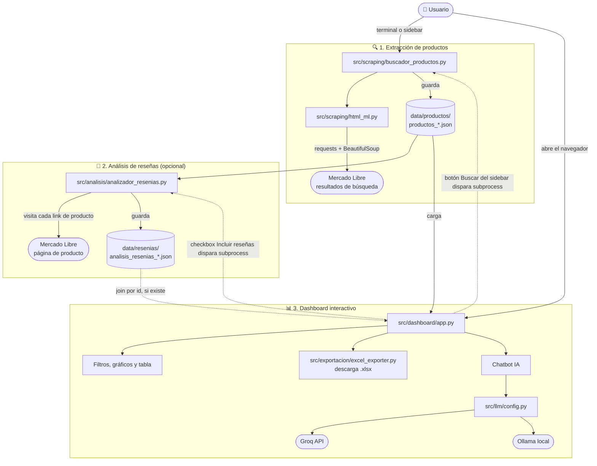

# 🛒 Análisis de Productos - Mercado Libre Argentina

Sistema para extraer, analizar y visualizar información de productos de Mercado Libre Argentina: scraping de resultados de búsqueda, extracción del resumen de reseñas generado por IA de ML, export a Excel y un dashboard interactivo con chatbot (Groq/Ollama).

## ✨ Características

- 🔍 **Extracción de productos**: busca cualquier producto en Mercado Libre Argentina y guarda precios, descuentos, calificaciones, envío e imágenes en JSON.
- 🤖 **Análisis de reseñas**: extrae el resumen de opiniones generado por IA de cada producto.
- 📊 **Export a Excel**: convierte los JSON de productos en un `.xlsx` con clasificación de precios y marcas.
- 📈 **Dashboard interactivo**: filtros dinámicos, gráficos (precio vs ventas, marcas, calificación) y un chatbot IA con acceso a los datos cargados.

## 🔄 Flujo de la app

Los componentes se comunican a través de archivos JSON en `data/`, no por llamadas directas: cada script se puede correr solo o ser disparado por el dashboard.



Flechas sólidas: flujo normal de datos. Flechas punteadas: la búsqueda en tiempo real del dashboard dispara los scripts de scraping/análisis como subprocess.

## 🚀 Inicio rápido

### Con Docker (recomendado)

```bash
docker-compose up -d
docker exec -it analisis-productos-ollama ollama pull llama3.2:8b
# Abrir http://localhost:8501
```

Ver la [guía completa de Docker](docs/docker.md) para configuración de Groq/Ollama, comandos útiles y troubleshooting.

### Local

```bash
pip install -r requirements.txt
cp env.example .env   # opcional: configurar GROQ_API_KEY u OLLAMA_BASE_URL

# 1. Extraer productos
python src/scraping/buscador_productos.py "auriculares bluetooth"

# 2. (Opcional) Analizar reseñas con IA
python src/analisis/analizador_resenias.py data/productos/productos_auriculares_bluetooth_*.json

# 3. Ejecutar el dashboard
streamlit run src/dashboard/app.py
```

También podés buscar productos directamente desde el sidebar del dashboard, sin usar la terminal.

## 📁 Estructura del proyecto

```
mercado-libre-product-intelligence/
├── src/
│   ├── scraping/        # obtención de HTML y extracción de productos de ML
│   ├── analisis/        # extracción del resumen de reseñas con IA
│   ├── exportacion/      # conversión de JSON a Excel
│   ├── llm/              # configuración de proveedores LLM (Groq/Ollama)
│   └── dashboard/        # app de Streamlit
├── data/
│   ├── productos/        # JSONs de productos generados
│   └── resenias/         # JSONs de análisis de reseñas generados
├── tests/                # tests de pytest
├── docs/                 # guía de Docker y anexo de uso detallado
├── Dockerfile
├── docker-compose.yml
└── requirements.txt
```

## 📚 Más información

- [docs/uso.md](docs/uso.md) — formato de salida JSON, más ejemplos de búsqueda, consideraciones de uso responsable y troubleshooting.
- [docs/docker.md](docs/docker.md) — guía completa de Docker + Ollama/Groq.

## ⚠️ Uso responsable

Evitá requests demasiado frecuentes a Mercado Libre para no ser bloqueado, y revisá sus términos de servicio. Proyecto con fines educativos de análisis de mercado.

---

Autor: Tomas Cabrera
